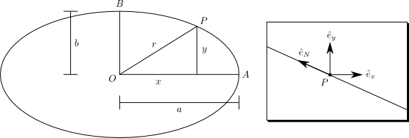

The Earth is *not* an ellipsoid
===============================

Abstract
--------

One of the first things you learn about the shape of the Earth after being told that it is spherical is that it actually
is *not* spherical. Systems like GPS model the Earth as an ellipsoid with differing radii at the rotational poles and
the equator but *is* the ideal Earth even an ellipsoid?

Introduction
------------

Recently I had to do some work with geographic projections and was marvelling at the number of different ways there seem
to be to locate a point on the Earth's surface. Most non-trivial projections tend to assume the Earth is ellipsoidal
with some defined polar and equatorial radii along with mind-bogglingly precise estimates of the centre of mass of the
Earth; the `WGS84 datum <http://en.wikipedia.org/wiki/World_Geodetic_System>`_ claims an accuracy of less than 2cm. I
wondered how hard it would be to work out what the true shape of the ideal Earth is and whether I could do it with
nothing more than first-year undergraduate Physics.

Notation
--------

We'll start with a diagram showing a 2D cross-section or 'slice' through the Earth which includes the axis of rotation:

It is a reasonable assumption that the Earth is symmetric around its rotational axis. We can therefore just consider the
shape of this slice and assert that the Earth is a solid of revolution by symmetry. The figure above shows the geometry
of that slice through the Earth. The centre of mass of the Earth is at :math:`O` and a point on the surface is at
:math:`(x, y)`. The y-axis is parallel to the line segment :math:`OB` which is also the rotational axis. The line
segment :math:`OA` is perpendicular to :math:`OB` and is parallel to the x-axis.

On the right of the figure we have zoomed in on the point and labelled some unit vectors defining a co-ordinate system
on the surface. The unit vectors :math:`\hat{e}_x` and :math:`\hat{e}_y` point, respectively, along the x- and y-axes.
The unit vector :math:`\hat{e}_N` points along the surface of the Earth in a northerly direction, i.e. in the direction
one must walk to reach :math:`B`.

Assuming the Earth is an ellipsoid
----------------------------------

Firstly, let's proceed by assuming that the Earth *is* an ellipsoid. If so, our slice is an ellipse and we can label the
major and minor radii :math:`a` and :math:`b`. Pythagoras tells us that

.. math:: \frac{x^2}{a^2} + \frac{y^2}{b^2} = 1.

If we differentiate with respect to :math:`x` we get

.. math::

    \frac{2x}{a^2} + \frac{2y}{b^2} \frac{dy}{dx} = 0
    \qquad \Rightarrow \qquad
    \frac{dy}{dx} = - \frac{b^2}{a^2} \frac{x}{y}.

If we let :math:`\hat{e}_N = n_x \hat{e}_x + n_y \hat{e}_y` then it is clear that, at :math:`P`,

.. math::
    :label: ellipse

    \frac{dy}{dx} = \frac{-n_y}{-n_x}
    \qquad \Rightarrow \qquad
    \frac{n_y}{n_x} = - \frac{b^2}{a^2} \frac{x}{y}.

This is the relation that must be true for the Earth to be an ellipsoid: at all points on the surface :math:`n_y / n_x`
must be proportional to :math:`x / y`. In the next section we'll see if that is true when we consider the physical
equations governing the shape of the Earth.

The physics of the Earth's surface
----------------------------------

Why does the Earth bulge in the middle? The traditional answer is that the centrifugal force 'throws' the surface out
more at the equator than at the poles. This is almost true. In fact it is better to think as the Earth's surface as a
liquid which 'slips' over the globe until it finds an equilibrium point. Since we're assuming the Earth is symmetric
around its axis of rotation, this equilibrium point is only North-South. A point mass on the surface of the Earth will
have the North-South centrifugal force exactly cancelled by the North-South force due to gravity. This must be true
otherwise a ball on the ground would roll Northward or Southward.

Let's consider a point-mass at :math:`P` with mass :math:`m`. The centrifugal force will be directed along the
:math:`\hat{e}_x` direction (i.e. away from the axis of rotation). If the Earth has angular velocity :math:`\omega` then
elementary mechanics tells us that the centrifugal force is

.. math:: f_c = \frac{m x^2 \omega^2}{r} \hat{e}_x.

The force due to gravity is also simple to write down. It acts to pull the mass towards :math:`O` backwards along the
radial direction :math:`\hat{e}_r`. If :math:`\theta` is the angle :math:`OP` makes to :math:`OA` then some geometry
tells us that

.. math:: \hat{e}_r = \hat{e}_x \cos \theta + \hat{e}_y \sin \theta = \frac{x}{r} \hat{e}_x + \frac{y}{r} \hat{e}_y

and so the force due to gravity is

.. math:: f_g = - \frac{G m_e m}{r^2} \hat{e}_r

where :math:`m_e` is the mass of the Earth and :math:`G` is the gravitational constant..

Calculating the shape of the Earth
----------------------------------

Our physical condition is that the North-South gravity and centrifugal forces cancel and so

.. math::

    f_c \cdot \hat{e}_N + f_g \cdot \hat{e}_N = 0
    \qquad \Rightarrow \qquad
    \frac{m x^2 \omega^2}{r} \hat{e}_x \cdot \hat{e}_N -
    \frac{G m_e m}{r^2} \hat{e}_r \cdot \hat{e}_N
    = 0.

We can simplify this equation by multiplying both sides by :math:`r/m` to get

.. math:: 
    :label: phys-cond

    {x^2 \omega^2} \hat{e}_x \; \cdot \hat{e}_N -
    \frac{G m_e }{r} \hat{e}_r \; \cdot \hat{e}_N
    = 0.

Using our definition that :math:`\hat{e}_N = n_x \hat{e}_x + n_y \hat{e}_y`, it follows that

.. math:: 

    {x^2 \omega^2} n_x - \frac{G m_e }{r} \left[ \frac{x}{r} n_x + \frac{y}{r} n_y \right]
    = {x^2 \omega^2} n_x - G m_e \left[ \frac{x}{r^2} n_x + \frac{y}{r^2} n_y \right]
    = 0.

Collecting like terms we obtain

.. math::
    G m_e \frac{y}{r^2} n_y = \left[ - Gm_e \frac{x}{r^2} + x^2 \omega^2 \right] n_x
    \qquad \Rightarrow \qquad
    \frac{n_y}{n_x} = - \frac{x}{y} + \frac{\omega^2}{G m_e} \frac{x^2 r^2}{y}

and one more re-arrangement gives our final form which can be compared to :eq:`ellipse`.

.. math::
    :label: phys-result

    \frac{n_y}{n_x}
    = - \left[ 1 - \frac{\omega^2}{G m_e} x r^2 \right] \frac{x}{y}
    = - [ 1 - \kappa_{x,r} ] \frac{x}{y},
    \qquad\qquad
    \kappa_{x,r} = \frac{\omega^2}{G m_e} x r^2.

As expected our final relation is dimensionally consistent as the gravitational constant :math:`G` has units of length
:superscript:`3` mass :superscript:`-1` time :superscript:`-2`.

Interestingly, this *almost* matches. In :eq:`phys-result` the constant of proportionality is not a constant but a value
which varies with position. Unfortunately this differential equation has no analytic solution and so one cannot write
down an equation for the physical surface of an ideal Earth.

The question does arise, however, exactly *how much* is the Earth not a sphere. At the North and South rotational poles
the differential equation describes a sphere but at the equator, according to `Wolfram Alpha`_, :math:`\kappa_{x,r} =
0.00346`. If the Earth were an ellipsoid the ratio of the radius at the equator to that at the pole would be
around :math:`1 / \sqrt{1 - 0.00346} \approx 1.0017` or 0.17% larger.

Finally, if the Earth were to stop rotating so that :math:`\omega = 0`, you can see that :math:`\kappa_{r,x} = 0` and
hence the Earth would, eventually, become a perfect sphere.

.. _`Wolfram Alpha`: http://www.wolframalpha.com/input/?i=%28equatorial+radius+of+earth+^+3%29+*+%28angular+velocity+of+earth%29^2+%2F+%28gravitational+constant+*+mass+of+the+Earth%29
